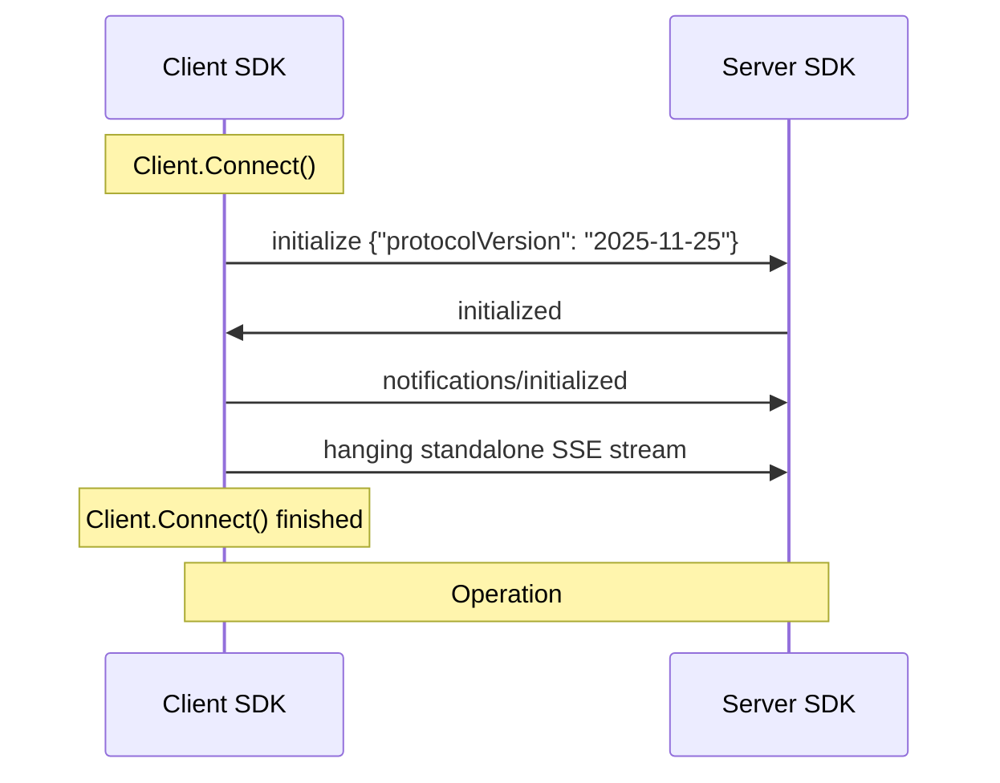

# Stateless MCP for 2026-06-30 protocol version

This document discusses the changes needed to fully support protocol changes introduced
in `2026-06-30` version. It focuses on the following SEPs:

* [SEP-2322: Multi Round-Trip Requests](https://github.com/modelcontextprotocol/modelcontextprotocol/pull/2322)
* [SEP-2567: Sessionless MCP via Explicit State Handles](https://github.com/modelcontextprotocol/modelcontextprotocol/pull/2567)
* [SEP-2575: Make MCP Stateless](https://github.com/modelcontextprotocol/modelcontextprotocol/pull/2575)

These proposals together define a stateless and sessionless protocol that is largely
incompatible with its previous version. This poses challenges given our commitment to
not introducing backwards incompatible changes to the SDK.

## Design decisions

### Stateless mode reuse

On the server side, there already exists a `Stateless` mode that works similarly to
what the proposals define. We will make it a dependency of the new protocol version
support - only servers that will enable it will be able to support the new version.

This will simplify the implementation and provide opt-in mechanism for the new behavior.
Such opt-in is needed, because it's not possible to automatically enable the new protocol
version for all SDK users, especially if they are using functionality that is removed
in the new version. `Stateless` mode already disallows many features that were removed.
Any backwards incompatible behavior changes will be guarded by `MCPGODEBUG` flags
to give developers more time to adapt.

Note: For v2, it would make sense to rename `ClientSession` to avoid confusion.
`ServerSession` should be removed.

### Keeping the session-based APIs

Session objects (`ServerSession`/`ClientSession`) are the core part of the Go MCP SDK API.
They are returned from `Connect` functions and they are used to interact with the peer.
Even though SEP-2567 removes the concept of sessions from the protocol, we cannot simply remove
these objects. Instead, we will adjust their lifetime of the server side to be per-request
and attempt to fill the session state on both sides with the most appropriate data available.

## Connection establishment

There are several changes affecting how the connection from the client to the server is established.

### Initialization handshake removal

> [!WARNING]
> Deprecated APIs:
> - `ServerOptions.InitializedHandler`

SEP-2575 removes the initialization handshake from the protocol. This means that
we need adjust the way we establish the protocol version and the capabilities of the peer.

#### Protocol version

For the server side, the protocol version will come in each request. It will be used to populate
`ServerSession.state.InitializeParams` and used for the call duration. Initialize request with
`2026-06-30` protocol version specified will be rejected.

For client side, the protocol version must be provided in each request. We cannot depend
on the initialization for provide a negotiated version. Instead, the server returns
`UnsupportedProtocolVersionError` if the version specified by the client is not supported.
The error also contains a list of `supported` versions. If any of them is supported by the client,
then one of two things will happen:

* the version will be saved to `ClientSession.state.InitializeResult` and used in subsequent requests if it is `>= 2026-06-30`
* normal initialization will be performed if it is `< 2026-06-30`

New types in `protocol.go`:

```go
const ErrCodeUnsupportedProtocolVersion = -32602 // INVALID_PARAMS per SEP-2575

type UnsupportedProtocolVersionData struct {
    Supported []string `json:"supported"`
    Requested string   `json:"requested"`
}
```

The protocol version may also be determined by calling `ServerDiscover` with sufficiently modern
servers. See [Server Capabilities](#server-capabilities) for details.

#### Server Capabilities

SEP-2575 introduces `server/discover` as a replacement for capability exchange during initialization.
It returns `supportedVersions`, `capabilities`, `serverInfo`,
and `instructions` — effectively the same information that was in `InitializeResult`, plus
the list of supported protocol versions.

It will also be available to old clients — it is harmless and
does not require initialization.

New types in `protocol.go`:

```go
type DiscoverParams struct {
    Meta `json:"_meta,omitempty"`
}

type DiscoverResult struct {
    SupportedVersions []string            `json:"supportedVersions"`
    Capabilities      *ServerCapabilities `json:"capabilities"`
    ServerInfo        *Implementation     `json:"serverInfo"`
    Instructions      string              `json:"instructions,omitempty"`
}
```

The handler will be registered with the `missingParamsOK` flag and will be allowed
pre-initialization.
It will be implemented on `Server` (not `ServerSession`) since it is not session-scoped.
The handler will use `Server.capabilities()` and `Server.impl` to construct the response.

On the client side, `server/discover` will be called during connection establishment to determine the protocol version to be used.
If the server returns `Method not found`, the client knows the server is pre-`2026-06-30` and should
fall back to the initialization handshake.
The capabilities and protocol version from the `server/discover` result will be saved tp `ClientSession.state.InitializeResult`.
This ensures that existing client code that reads `ClientSession.InitializeResult` will continue to work without changes.

> [!WARNING]
> Deprecated APIs:
> - `ClientSession.InitializeResult`

#### Client Capabilities

SEP-2575 moves client capabilities from session-level negotiation to per-request `_meta` fields:

* `io.modelcontextprotocol/protocolVersion` (string, required)
* `io.modelcontextprotocol/clientInfo` (`Implementation`, required)
* `io.modelcontextprotocol/clientCapabilities` (`ClientCapabilities`, required)
* `io.modelcontextprotocol/logLevel` (`LoggingLevel`, optional)

On the server side, the stateless session handler will extract these fields from each incoming
request's `_meta` and populate `ServerSession.state.InitializeParams` with the values for the
duration of the call. This ensures that existing server code that reads `ServerSession.InitializeParams()`
continues to work without changes. The extraction will happen in the `ServerSession.handle()` method,
before dispatching to the registered handler.
If a server receives a request with missing `_meta` fields, it will return `INVALID_PARAMS`
(-32602) when operating with `>= 2026-06-30`.

> [!WARNING]
> Deprecated APIs:
> - `ServerSession.InitializeParams`
> - `ServerOptions.InitializedHandler`

On the client side, `ClientSession` will automatically populate these `_meta` fields on every
outgoing request when operating with `>= 2026-06-30` protocol version. The values will come from
`ClientOptions` (for `clientInfo` and `clientCapabilities`) and from the negotiated
protocol version.

### SSE standalone stream removal

SEP-2575 removes the HTTP GET endpoint used for standalone SSE streaming. In the new protocol
version, GET requests MUST return `405 Method Not Allowed`. This is already the behavior in
`Stateless` mode (`streamable.go:336-342`), so no new server-side changes are needed for
stateless servers.

The standalone SSE stream was used for two purposes:

1. Server-to-client notifications outside the context of a request (e.g., `notifications/tools/list_changed`)
2. Server-to-client requests (e.g., `ping`, sampling, elicitation)

Purpose (1) is replaced by a new `subscriptions/listen` RPC method.
Purpose (2) is replaced by MRTR (see [Changed paradigm for server to client communication](#changed-paradigm-for-server-to-client-communication)).

On the client side, the streamable client transport currently opens a GET SSE stream after
initialization. For `>= 2026-06-30` protocol versions, this step will be skipped. The client
will instead use `subscriptions/listen` if it needs to receive server-initiated notifications.

### Ping

SEP-2575 removes `ping` in both directions. Server-to-client ping is removed because servers
can no longer independently send requests. Client-to-server ping is removed because any normal
RPC call proves server liveness, and transport-layer mechanisms (HTTP keep-alives, SSE comments)
handle connection-health checks.

Currently, `ping` is used in two ways:

1. Explicit calls via `ServerSession.Ping()` / `ClientSession.Ping()` (`server.go:1167`, `client.go:966`)
2. Keepalive mechanism via `startKeepalive()` (`shared.go:577-622`)

For `>= 2026-06-30`:

* Sending a `ping` request will return `Method not found` (-32601).
* `ServerSession.Ping()` will return an error for stateless sessions (already the case:
  `streamable.go:1367-1369`).
* `ClientSession.Ping()` will continue to exist for backwards compatibility but will return
  an error if the server doesn't support it (`ErrMethodNotFound` from keepalive is already
  handled gracefully — `shared.go:607-610`).
* The keepalive mechanism will be disabled for stateless sessions. Currently, keepalive starts
  even for stateless sessions and races with `defer session.Close()` (`streamable_test.go:366-374`).
  For the new protocol version, `Server.Connect()` should skip `startKeepalive` when operating
  in stateless mode.

Removal will be gated by MCPGODEBUG flag `mcpping` defaulting to `mcpping=enabled` (keep the
method) initially, switching to `mcpping=disabled` to remove it. The keepalive graceful
degradation (`ErrMethodNotFound` → silently stop) means that even without the flag, clients
connecting to new servers will work correctly.

> [!WARNING]
> Deprecated APIs:
> - `ClientSession.Ping`
> - `ServerSession.Ping`


### SDK connection establishment flow changes

#### Original flow



#### Updated flow

```mermaid
sequenceDiagram
    participant c as Client SDK
    participant s as Server SDK

    Note over c: Client.Connect()
    c->>s: server/discover
    
    alt 2026-06-30 version supported
        s->>c: {supported: ["2026-06-30"]}
        opt if notification handlers configured
            c->>s: hanging subscribe/listen
        end
        note over c: Client.Connect() finished
        note over c,s: Operation using 2026-06-30 version
    else 2026-06-30 version not supported
        s->>c: failed or "2026-06-30" not in supported list
        note over c,s: fall back to legacy flow
        c->>s: initialize {"protocolVersion": "2025-11-25"}
        s->>c: initialized
        c->>s: notifications/initialized
        c->>s: hanging standalone SSE stream
        note over c: Client.Connect() finished
        note over c,s: Operation using 2025-11-25 version
    end
