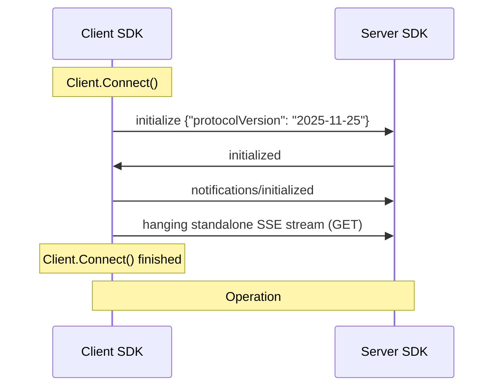
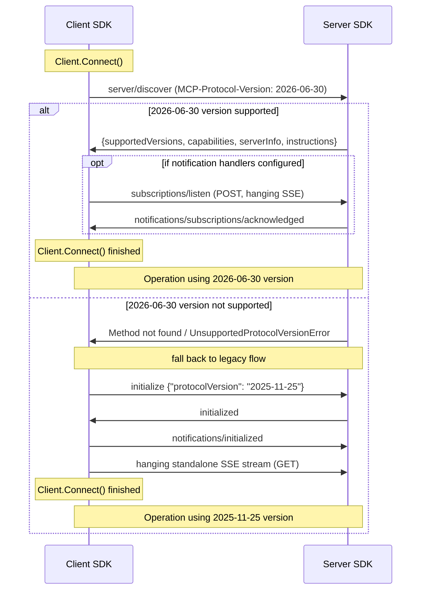
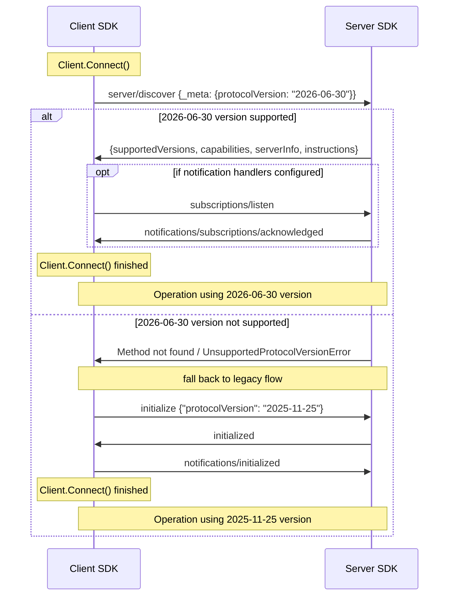

# Stateless MCP for 2026-06-30 protocol version

This document discusses the changes needed to fully support protocol changes introduced
in `2026-06-30` version. It focuses on the following SEPs:

* [SEP-2567: Sessionless MCP via Explicit State Handles](https://github.com/modelcontextprotocol/modelcontextprotocol/pull/2567)
* [SEP-2575: Make MCP Stateless](https://github.com/modelcontextprotocol/modelcontextprotocol/pull/2575)

These proposals together define a stateless and sessionless protocol that is largely
incompatible with its previous version. This poses challenges given our commitment to
not introduce backwards incompatible API changes to the SDK.

## Design decisions

### Stateless mode reuse

On the HTTP server side, there already exists a `StreamableHTTPOptions.Stateless` mode that
works similarly to what the proposals define. We will make it a dependency of the new protocol
version support for the HTTP transport — only HTTP servers that enable it will be able to
serve `>= 2026-06-30` requests. For STDIO and other transports, no transport-level option is
needed; protocol-level behavior is driven by per-request detection (see
[Per-request protocol detection](#per-request-protocol-detection)).

This will simplify the implementation and provide opt-in mechanism for the new behavior.
Such opt-in is needed, because it's not possible to automatically enable the new protocol
version for all SDK users, especially if they are using functionality that is removed
in it. `Stateless` mode already disallows many such features that are removed.
Any backwards incompatible behavior changes will be guarded by `MCPGODEBUG` flags
to give developers more time to adapt.

> [!NOTE]
> Deprecated APIs:
> For v2, it would make sense to rename `ClientSession` to avoid confusion.
`ServerSession` should be removed.

### Keeping the session-based APIs

Session objects (`ServerSession`/`ClientSession`) are the core part of the Go MCP SDK API.
They are returned from `Connect` functions and they are used to interact with the peer.
Even though SEP-2567 removes the concept of sessions from the protocol, we cannot simply remove
these objects. Instead, we will adjust their lifetime of the server side to be per-request
and attempt to fill the session state on both sides with the most appropriate data available.

### Per-request protocol detection

The presence of `io.modelcontextprotocol/protocolVersion` in a request's `_meta` implicitly
signals that the request follows the new protocol. No explicit flag is needed at the protocol
level — `ServerSession.handle()` detects the field and adjusts behavior per-request.

The detection mechanism works as follows:

1. Before the initialization gate, `ServerSession.handle()` performs a lightweight partial
   unmarshal of `_meta` from the raw `jreq.Params`:

   ```go
   var meta struct {
       Meta Meta `json:"_meta"`
   }
   internaljson.Unmarshal(jreq.Params, &meta)
   ```

2. If `io.modelcontextprotocol/protocolVersion` is present in `meta.Meta`, the initialization
   gate is skipped (the request is allowed regardless of `ServerSession.state.InitializeParams`
   being `nil`). Required `_meta` fields (`clientInfo`, `clientCapabilities`) are validated.

3. New accessor methods on `ServerRequest[P]` provide typed per-request access:

   ```go
   func (r *ServerRequest[P]) ProtocolVersion() string
   func (r *ServerRequest[P]) ClientCapabilities() *ClientCapabilities
   func (r *ServerRequest[P]) ClientInfo() *Implementation
   ```

   These read from `r.Params.GetMeta()` with fallback to `r.Session.InitializeParams()`
   for old protocol requests. Since validation already happened in `handle()`, the
   accessors assume data is well-formed and do not return errors.

4. `ServerSession.InitializeParams()` returns `nil` for new-protocol sessions — there is no
   pre-population of session state. Returning `nil` is a clear signal to callers that they
   should use the `ServerRequest` accessors instead.

This mechanism is transport-agnostic: it works on HTTP and STDIO identically. A single
session can serve both old and new protocol requests, with each request handled according
to its own `_meta`. For HTTP, `StreamableHTTPOptions.Stateless` remains needed for
transport-level concerns (per-request session lifecycle, HTTP method gating). For STDIO,
no transport-level option is needed.

The body-peeking and state pre-population in `ephemeralConnectOpts` becomes unnecessary
for new-protocol requests since `handle()` skips the initialization gate based on `_meta`.
Pre-population remains for old-protocol requests on stateless HTTP servers (where the
client skips `initialize` but doesn't send `_meta`).

## Connection establishment

There are several changes affecting how the connection from the client to the server is established.

### Initialization handshake removal

> [!WARNING]
> Deprecated APIs:
> - `ServerOptions.InitializedHandler`

SEP-2575 removes the initialization handshake from the protocol. This means that
we need adjust the way we establish the protocol version and the capabilities of the peer.

#### Protocol version

For the server side, the protocol version will come in each request's `_meta` field
(`io.modelcontextprotocol/protocolVersion`). It is detected via the partial unmarshal in
`ServerSession.handle()` (see [Per-request protocol detection](#per-request-protocol-detection))
and is not stored in session state. Per-request access is provided by the new
`req.ProtocolVersion()` accessor on `ServerRequest`.

An `initialize` request with `2026-06-30` protocol version specified will be rejected with
`Method not found` (-32601), since the initialization handshake does not exist in the new
protocol version.

For client side, the protocol version must be provided in each request. We cannot depend
on the initialization for provide a negotiated version. Instead, the server returns
`UnsupportedProtocolVersionError` if the version specified by the client is not supported.
The exact procedure for the determination of the protocol version is presented in more detail
in [SDK connection establishment flow changes](#sdk-connection-establishment-flow-changes).

New types in `protocol.go`:

```go
const ErrCodeUnsupportedProtocolVersion = -32602 // INVALID_PARAMS per SEP-2575

type UnsupportedProtocolVersionData struct {
    Supported []string `json:"supported"`
    Requested string   `json:"requested"`
}
```

#### Server Capabilities

SEP-2575 introduces `server/discover` as a convenience replacement for capability exchange during initialization.
It will return `supportedVersions`, `capabilities`, `serverInfo`,
and `instructions` — effectively the same information that was in `InitializeResult`, plus
the list of supported protocol versions.

It will also be available to old clients — it is harmless and
does not require initialization.

New types in `protocol.go`:

```go
type DiscoverParams struct {
    Meta `json:"_meta,omitempty"`
}

type DiscoverResult struct {
    SupportedVersions []string            `json:"supportedVersions"`
    Capabilities      *ServerCapabilities `json:"capabilities"`
    ServerInfo        *Implementation     `json:"serverInfo"`
    Instructions      string              `json:"instructions,omitempty"`
}
```

The handler will be registered with the `missingParamsOK` flag and added to the
pre-initialization allow-list in `ServerSession.handle()` alongside `initialize`, `ping`,
and `notifications/initialized`. It will be implemented on `Server` (not `ServerSession`)
since it is not session-scoped. The handler will use `Server.capabilities()` and
`Server.impl` to construct the response.

To determine which versions to include in `supportedVersions`, the server checks whether
the transport supports each version via a new exported interface:

```go
// ProtocolVersionSupporter may be implemented by a Transport to declare which
// protocol versions it can serve. If a Transport does not implement this
// interface, all SDK-supported versions are assumed to be supported.
type ProtocolVersionSupporter interface {
    SupportsProtocolVersion(version string) bool
}
```

`Server.Connect()` checks whether the passed `Transport` implements
`ProtocolVersionSupporter`. If it does, the result is used to filter the SDK's
`supportedProtocolVersions` list. The filtered list is stored on the `ServerSession`
at connection time and used by the `server/discover` handler to build
`DiscoverResult.SupportedVersions`.

`StreamableServerTransport` implements this interface: it returns `true` for `2026-06-30`
only when `Stateless` is `true`. STDIO transports (`StdioTransport`, `IOTransport`) and
`InMemoryTransport` do not need to implement the interface — the default behavior assumes
they support all SDK versions, which matches their capabilities. Custom transports may
implement the interface to constrain which versions they advertise.

On the client side, `server/discover` will be called during connection establishment to determine
the protocol version to be used. The client will send `server/discover` with `2026-06-30` as the
protocol version in both the `MCP-Protocol-Version` header and the `_meta` payload. The full
per-request `_meta` fields (`clientInfo`, `clientCapabilities`) will also be included, using the
values from `ClientOptions`. This means the transport's `setMCPHeaders` must be able to set the
`MCP-Protocol-Version` header before `initializedResult` is populated.

If the server returns `Method not found` or `UnsupportedProtocolVersionError`, the client knows
the server is pre-`2026-06-30` and should fall back to the initialization handshake.
This will result in an additional round-trip for older servers.

The capabilities and protocol version from the `server/discover` result will be saved to
`ClientSession.state.InitializeResult`, with `ProtocolVersion` set to the latest version from
`DiscoverResult.SupportedVersions` that the client also supports.
This ensures that existing client code that reads `ClientSession.InitializeResult` will continue
to work without changes.

> [!WARNING]
> Deprecated APIs:
> - `ClientSession.InitializeResult`

#### Client Capabilities

SEP-2575 moves client capabilities from session-level negotiation to per-request `_meta` fields:

* `io.modelcontextprotocol/protocolVersion` (string, required)
* `io.modelcontextprotocol/clientInfo` (`Implementation`, required)
* `io.modelcontextprotocol/clientCapabilities` (`ClientCapabilities`, required)
* `io.modelcontextprotocol/logLevel` (`LoggingLevel`, optional)

On the server side, `ServerSession.handle()` validates that the required `_meta` fields
(`protocolVersion`, `clientInfo`, `clientCapabilities`) are present for `>= 2026-06-30` requests.
If a request is missing required `_meta` fields, the server will return `INVALID_PARAMS`
(-32602).

The fields are not copied into session state. Instead, new accessor methods on
`ServerRequest[P]` provide typed per-request access:

```go
func (r *ServerRequest[P]) ProtocolVersion() string
func (r *ServerRequest[P]) ClientCapabilities() *ClientCapabilities
func (r *ServerRequest[P]) ClientInfo() *Implementation
```

These read from `r.Params.GetMeta()` with fallback to `r.Session.InitializeParams()` for
old protocol requests. Existing handler code should migrate from the session-level accessor
to the request-level accessor:

```go
// Old:
caps := req.Session.InitializeParams().Capabilities
// New:
caps := req.ClientCapabilities()
```

`ServerSession.InitializeParams()` returns `nil` for new-protocol sessions (no state
pre-population). For old-protocol sessions, it continues to return the `InitializeParams`
from the `initialize` handshake.

> [!WARNING]
> Deprecated APIs:
> - `ServerSession.InitializeParams`
> - `ServerOptions.InitializedHandler`

On the client side, `ClientSession` will automatically populate these `_meta` fields on every
outgoing request when operating with `>= 2026-06-30` protocol version. The values will come from
`ClientOptions` (for `clientInfo` and `clientCapabilities`) and from the negotiated
protocol version.

### SSE standalone stream removal

SEP-2575 removes the HTTP GET endpoint used for standalone SSE streaming. In the new protocol
version, GET requests MUST return `405 Method Not Allowed`. This is already the behavior in
`Stateless` mode (`streamable.go:336-342`), so no new server-side changes are needed for
stateless servers.

The standalone SSE stream was used for two purposes:

1. Server-to-client notifications outside the context of a request (e.g., `notifications/tools/list_changed`)
2. Server-to-client requests (e.g., `ping`, sampling, elicitation)

Purpose (1) will be replaced by a new `subscriptions/listen` RPC method.
Purpose (2) will be replaced by MRTR ([SEP-2322](https://github.com/modelcontextprotocol/modelcontextprotocol/pull/2322)).

On the client side, the streamable client transport currently opens a GET SSE stream after
initialization. For `>= 2026-06-30` protocol versions, this step will be skipped. The client
will instead send `subscriptions/listen` during `Client.Connect()` if any of the following
`ClientOptions` handlers are configured:

* `ToolListChangedHandler` → subscribes to `toolsListChanged`
* `PromptListChangedHandler` → subscribes to `promptsListChanged`
* `ResourceListChangedHandler` → subscribes to `resourcesListChanged`
* `LoggingMessageHandler` → subscribes with `logLevel`

If none of these handlers are set, no `subscriptions/listen` call will be made during `Connect()`.
Presence of `ResourceUpdateHandler` will not automatically trigger `subscriptions/listen` during
`Connect()`, as Resource notifications require URIs to be specified. Instead, each call to
`ClientSession.Subscribe()` will start a new `subscriptions/listen` stream for the specified
Resource. Calling `ClientSession.Unsubscribe()` will cancel that stream.
On the server side, the server will return `Method not found` (-32601) for `resource/subscribe` and
`resource/unsubscribe` when `>= 2026-06-30`.

> [!WARNING]
> Deprecated APIs:
> - `ClientSession.Subscribe`
> - `ClientSession.Unsubscribe`
> - `StreamableClientTransport.DisableStandaloneSSE`

### Ping

SEP-2575 removes `ping` in both directions. Server-to-client ping is removed because servers
can no longer independently send requests. Client-to-server ping is removed because any normal
RPC call proves server liveness, and transport-layer mechanisms (HTTP keep-alives, SSE comments)
handle connection-health checks.

Currently, `ping` is used in two ways:

1. Explicit calls via `ServerSession.Ping()` / `ClientSession.Ping()` (`server.go:1167`, `client.go:966`)
2. Keepalive mechanism via `startKeepalive()` (`shared.go:577-622`)

For `>= 2026-06-30`:

* Sending a `ping` request will return `Method not found` (-32601).
* `ServerSession.Ping()` will return an error for stateless HTTP transport (already the case:
  `streamable.go:1367-1369`).
* `ClientSession.Ping()` will continue to exist for backwards compatibility but will return
  an error if the server doesn't support it (`ErrMethodNotFound` from keepalive is already
  handled gracefully — `shared.go:607-610`).
* The keepalive mechanism does not need explicit disabling for the new protocol. The existing
  graceful degradation handles it: when keepalive sends a `ping` and the peer returns
  `Method not found`, `startKeepalive` stops silently (`shared.go:607-610`). For stateless
  HTTP sessions, keepalive remains pointless (sessions are ephemeral and the keepalive races
  with `defer session.Close()`); to surface this misconfiguration, `StreamableHTTPHandler`
  will log a warning if it receives a `Server` with `KeepAlive` set while operating in
  `Stateless` mode.

> [!WARNING]
> Deprecated APIs:
> - `ClientSession.Ping`
> - `ServerSession.Ping`
> - `ServerOptions.Keepalive`

### SDK connection establishment flow changes

#### Original flow (HTTP)



#### Updated flow (HTTP)



#### Updated flow (STDIO)

STDIO follows the same logic as HTTP but without HTTP-specific mechanisms (headers, SSE streams).
The protocol version is conveyed only via the `_meta` field. The SEP recommends using
`server/discover` for STDIO to determine the server's version, since there is no per-request
HTTP error status to detect version mismatches.



## Removing sessions

SEP 2567 removes the concept of sessions from the MCP protocol. Some adjustments will be
needed to the `Stateless` mode to fully align it with the proposal.

### `MCP-Session-Id` header removal

Server in stateless mode will ignore the `MCP-Session-Id` header in the requests.
Currently it doesn't reject requests that specify this header, but it reads the
value and saves it in the transport to be used in other places.
The `ServerOptions.GetSessionID` will not be called by servers in the stateless
mode anymore. The `MCP-Session-Id` will also not be set on the response to
`initialize`, but this is a consequence of removal of the initialization handshake.

These behavior changes are backwards incompatible and will be accompanied by a `MCPGODEBUG` flag.

> [!WARNING]
> Deprecated APIs:
> - `ServerOptions.GetSessionID`
> - `StreamableHTTPOptions.SessionTimeout`
> - `StreamableServerTransport.SessionID`
> - `Connection.SessionID`
> - `ErrSessionMissing`
> - `ServerSessionState`
> - `Server.Sessions`
> - `Session.ID`

### DELETE method returns 405

The `DELETE` will return `405 Method Not Allowed` for all requests to the server in stateless mode.
This is in line with SEP-2575 that only `POST` requests should be supported. Currently it returns
`400 Bad Request` if `MCP-Session-Id` header is not provided and `204 No Content` otherwise.
The change will be protected by the same `MCPGODEBUG` flag as removal of the session related header.

## Removing stream resumability

SEP-2575 removes stream resumability. All related functionality will be deprecated.

For `>= 2026-06-30`, the following behavioral changes will apply:

* **Event IDs on SSE streams**: The server will stop writing event IDs (`id:` fields) to SSE
  response streams. Currently, event IDs are only written when an `EventStore` is configured
  (`streamable.go:1456-1458`). For the new protocol version, event IDs will not be written
  regardless of whether an `EventStore` is provided.

* **EventStore usage**: The server will not call `EventStore.Open`, `EventStore.Append`, or
  `EventStore.SessionClosed` for `>= 2026-06-30` requests, even if an `EventStore` is configured
  on the handler. Currently, the `EventStore` is called unconditionally when present
  (`streamable.go:864-866`, `1446-1448`), including in stateless mode, which leads to
  wasteful write-then-immediately-cleanup cycles. For the new protocol version, the `EventStore`
  will be ignored entirely.

* **`Last-Event-ID` on POST requests**: The server currently rejects POST requests that include
  a `Last-Event-ID` header with `400 Bad Request` (`streamable.go:1100-1101`). This behavior
  will remain unchanged — `Last-Event-ID` on POST was never valid and will continue to be
  rejected.

* **Client reconnection**: The client will stop sending `Last-Event-ID` on reconnection
  attempts (`streamable.go:2207-2208`) and will stop capturing event IDs from SSE streams
  (`streamable.go:2093-2094`). Reconnection for `subscriptions/listen` streams will still
  be supported (re-establishing the subscription from scratch), but without `Last-Event-ID`
  based replay.

* **`CloseSSEStream` callback**: Calling `RequestExtra.CloseSSEStream` will be a no-op for
  `>= 2026-06-30`. This mechanism (SEP-1699) was designed to trigger client reconnection
  with `Last-Event-ID` for server-initiated disconnect scenarios. Without resumability, closing
  the SSE stream is equivalent to cancelling the request, not triggering a reconnection.

> [!WARNING]
> Deprecated APIs:
> - `EventStore`
> - `MemoryEventStore`
> - `MemoryEventStoreOptions`
> - `NewMemoryEventStore`
> - `ErrEventsPurged`
> - `StreamableHTTPOptions.EventStore`
> - `StreamableServerTransport.EventStore`
> - `RequestExtra.CloseSSEStream`
> - `CloseSSEStreamArgs`